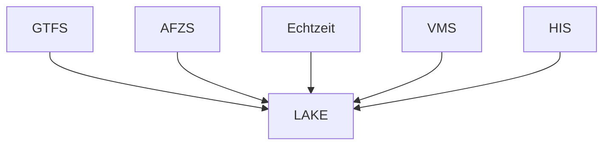

# ZVBN Datalake
Aufbau eines ZVBN Datelakes 
## Datenquellen
- Solldaten
  - GTFS   
- Echtzeit
  - RBL
  - Realtimearchiv Hacon
- AFZS
  - Rohdaten drpca
  - zugeordnete Daten aus mabinso, Cosmo
- Infrastruktur HIS
- VMS
  - Daten aus Redmine   

## Umsetzung
- Aufbauend auf DuckDB und Parquet

