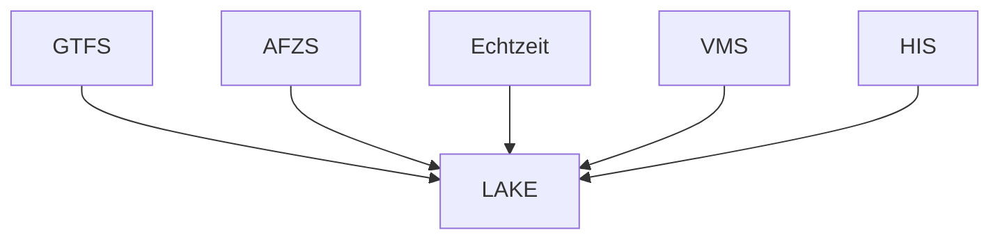

# ZVBN Datalake
Aufbau eines ZVBN Datelakes 
## Datenquellen
- Solldaten
  - GTFS   
- Echtzeit
  - RBL
  - Realtimearchiv Hacon
- AFZS
  - Rohdaten drpca
    - Zähldaten
    - GPS Tracks   
  - zugeordnete Daten aus mabinso, Cosmo
- Infrastruktur HIS
- VMS
  - Daten aus Redmine   

## Umsetzung
- Aufbauend auf DuckDB und Parquet

|Art|Format|Dateformat|Ablagae|
|--|---|---|---|
|GTFS|Sollfahrten pro Tag|Parquet|/home/zvbn/pyth|
